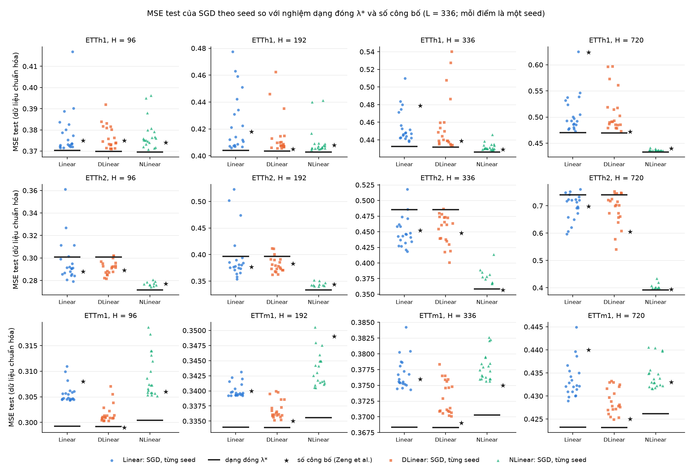

# SGD 20 seed trên ETTh1, ETTh2, ETTm1: bảng B1, B4 và trình tối ưu trên ETTh2

Ngày chạy: 06/10/2026 (Phần A, B), 07/10/2026 (Phần C). Nhiệm vụ: [NHIEM_VU_5.md](NHIEM_VU_5.md). Tiếp theo [BAO_CAO_ETTH2_2.md](BAO_CAO_ETTH2_2.md).

- Script: [`scripts/optim_etth2.py`](../scripts/optim_etth2.py) (A), [`scripts/sgd_etth2.py`](../scripts/sgd_etth2.py) (B), [`scripts/report_sgd_b1_b4.py`](../scripts/report_sgd_b1_b4.py) (mọi bảng B1, B4, C.3 và hình).
- Số liệu:
  - A: [`results/optim_etth2/`](../results/optim_etth2/) (bảng: `tables.md`);
  - B.3: [`results/sgd_b1_b4/a2/a2_etth1_H96_seed42.json`](../results/sgd_b1_b4/a2/a2_etth1_H96_seed42.json);
  - B: [`results/sgd_b1_b4/ETTh1/`](../results/sgd_b1_b4/ETTh1/), [`results/sgd_b1_b4/ETTm1/`](../results/sgd_b1_b4/ETTm1/); ETTh2 lấy từ [`results/sgd_etth2_20seed/`](../results/sgd_etth2_20seed/) (nhiệm vụ 4);
  - bảng và hình: [`results/sgd_b1_b4/tables.md`](../results/sgd_b1_b4/tables.md), `summary.json`, `H3_sgd_vs_optimum.png`.
- Máy: RTX 5060 Ti, CPU Intel, torch 2.14.0+cu130 (`.venv-gpu`), TF32 tắt. Mọi lần chạy SGD và mọi phép tính ở Phần A chạy trên **CPU** (SGD: huấn luyện float32, chấm điểm W_eff bằng float64; 6 luồng mỗi tiến trình; Phần A: float64).
- `git_commit` trong JSON: xem mục 2.3 (có 107 file ETTm1 ghi chuỗi rỗng).
- Thay đổi code: [NHAT_KY_THAY_DOI.md](NHAT_KY_THAY_DOI.md), mục 10.

Ký hiệu: "dạng đóng" là nghiệm MSE ở λ* (chọn theo val MSE trên lưới 141 λ, `results/results.csv`). Δ = trung bình SGD − dạng đóng; âm là SGD tốt hơn. CI là khoảng tin cậy 95% theo phân phối t (n − 1 bậc tự do); C.3 dùng CI Welch. "SGD" là Adam mini-batch của LTSF-Linear, dừng sớm theo val. Mọi kết luận chính dùng đủ seed, giữ cả seed hỏng.

## 1. Kết luận

**A. Trên Linear ETTh2 H = 720, GD toàn batch cho đúng nghiệm ridge; Adam toàn batch chỉ thắng trên test. Kết quả không khớp mẫu nào trong bảng A.3, nên không rút ra cơ chế.**

- **`gd_zero` (GD toàn batch từ 0, lr = 1/λ_max) đi qua đường ridge, đúng như lý thuyết:** val 0,6670, test 0,7401, so với λ* 0,6673 / 0,7404 (Δ −0,0002 / −0,0003). Ở bước tốt nhất, W gần W_ridge(λ = 1995) nhất (sai số tương đối 0,095). Không vượt ngưỡng 0,005 của A.2.
- **`gd_init` (GD toàn batch, khởi tạo như LTSF-Linear) cũng ≈ ridge:** Δ val = Δ test = +0,0003. CI rất hẹp (sd giữa 10 seed gần 0), nên nhãn hình thức là "dạng đóng tốt hơn thật", nhưng độ lớn không đáng kể. Khởi tạo ngẫu nhiên không tạo ra khoảng cách.
- **`adam_full` (Adam toàn batch, lr 0,05 chọn theo val):** Δ val −0,0011 [−0,0024; 0,0002] (hòa), Δ test −0,0551 [−0,0889; −0,0212] (thắng). Nhãn: "khác biệt do val khác test".
- **Adam mini-batch (20 seed, đã có):** Δ val −0,0082, Δ test −0,0437, cả hai thắng: "SGD tốt hơn thật".
- **Đối chiếu bảng A.3:** hai dòng GD ≈ ridge, nhưng `adam_full` không "thắng như Adam mini-batch" (val hòa) và cũng không "≈ ridge" (test thắng rõ). Không khớp mẫu nào, nên chỉ báo cáo số liệu. Theo NHIEM_VU_5, dừng điều tra cơ chế ETTh2 tại đây.

**B1. Số công bố nằm trong [min, max] của 20 seed ở 28/36 ô. Cả 8 ô nằm ngoài đều có số công bố thấp hơn mọi seed; 5 trong số đó là DLinear.**

- Ô nằm ngoài: DLinear ETTh1 H = 192, 720; DLinear ETTm1 H = 96, 192, 336; NLinear ETTh2 H = 336, 720; NLinear ETTm1 H = 336. **Không ô Linear nào** nằm ngoài.
- Với DLinear, số công bố nằm ở phân vị 0–10 ở 7/12 ô (5/12 ô ở phân vị 0). Số công bố của DLinear thường là một lần chạy may mắn so với phân phối theo seed của repo.
- **Linear, ETTh1, H = 720:** SGD của repo cho **0,5063 ± 0,0363** (trung vị 0,4927, [0,4727; 0,6250], 20 seed). Số công bố 0,624 nằm ở phân vị 95: chỉ một seed (0,6250) cao hơn. Dạng đóng λ* cho 0,4701 (0,4699 trong NHIEM_VU_3 là ở λ = 1,585e4 của tiêu chí chọn khác; xem `BAO_CAO_ETTH2_SGD.md`). Như vậy 0,624 có xảy ra với code này nhưng thuộc đuôi trên; trung bình SGD vẫn kém dạng đóng 0,036.

**B4. Trên 36 ô: SGD tốt hơn thật 6, dạng đóng tốt hơn thật 10, SGD có dấu hiệu khớp val quá mức 12, khác biệt do val khác test 7, không phân biệt được 1. Không ô nào ngoài ETTh2 có "SGD tốt hơn thật".**

- **ETTh1:** SGD thắng trên val ở 7/12 ô nhưng thua trên test ở cả 12/12 ô (Δ test +0,003 đến +0,040). Nhãn trội: "SGD có dấu hiệu khớp val quá mức" (7 ô).
- **ETTm1:** SGD thua trên test ở 12/12 ô (Δ test +0,0025 đến +0,0104). Dạng đóng tốt hơn thật ở 7 ô, gồm cả 4 ô NLinear và 3/4 ô Linear.
- **ETTh2:** cả 6 ô "SGD tốt hơn thật" đều ở đây (DLinear 4/4, Linear H = 336, 720). NLinear ETTh2 thì ngược lại (thua trên test ở 4/4 ô).
- Hiện tượng SGD tốt hơn nghiệm tối ưu trên test là **riêng ETTh2 với Linear/DLinear**, không lặp lại trên ETTh1, ETTm1.

**C.3. DLinear tốt hơn Linear có ý nghĩa khi huấn luyện bằng SGD ở 4/12 ô, cả 4 đều là ETTm1; trên ETTh1, ETTh2 không ô nào.**

- ETTm1: Δ (DLinear − Linear) test −0,0032 đến −0,0047, CI Welch nằm hẳn dưới 0 ở cả val lẫn test. Với dạng đóng, chênh lệch tương ứng chỉ −0,00003 đến −0,00004. Lợi thế của DLinear ở đây là lợi thế khi tối ưu bằng SGD, không phải lợi thế của lớp mô hình.
- ETTh1, ETTh2: mọi CI chứa 0. Chênh lệch lớn trong bài ở ETTh1 H = 720 (−0,152) và ETTh2 H = 720 (−0,093) không xuất hiện khi lấy trung bình 20 seed (+0,003 [−0,021; 0,028] và −0,010 [−0,044; 0,025]).
- Không ô nào Linear tốt hơn DLinear có ý nghĩa.

## 2. Cấu hình, thời gian, số seed

### 2.1. Siêu tham số (B.1)

Đọc từ `third_party/LTSF-Linear/scripts/EXP-LongForecasting/Linear/{etth1,etth2,ettm1}.sh`, các dòng 24, 38, 52, 66 (một dòng cho mỗi H, cả bốn dòng giống nhau trong mỗi file); epoch, patience, `lradj` lấy giá trị mặc định ở `third_party/LTSF-Linear/run_longExp.py` dòng 66, 68, 72 vì script không đặt. Ba mô hình dùng chung script (README của LTSF-Linear). Ghi trong `HPS` của `scripts/sgd_etth2.py` (dòng 54–56).

| Dataset | lr | batch | epoch | patience | lradj | nguồn lr, batch |
|---|---|---|---|---|---|---|
| ETTh1 | 0,005 | 32 | 10 | 3 | type1 | `Linear/etth1.sh` dòng 24/38/52/66 |
| ETTh2 | 0,05 | 32 | 10 | 3 | type1 | `Linear/etth2.sh` dòng 24/38/52/66 |
| ETTm1 | 0,0001 | 8 | 10 | 3 | type1 | `Linear/ettm1.sh` dòng 24/38/52/66 |

Chung: L = 336, individual = False, k = 25 (DLinear), khởi tạo mặc định của `nn.Linear`. Script gốc không mơ hồ ở điểm nào.

### 2.2. Kiểm trước khi chạy

- **B.3 (tái lập):** DLinear, ETTh1, H = 96, seed 42, lradj type1: **0,382463 / 0,404847**, tham chiếu 0,3825 / 0,4048. Đạt.
- **ETTh2 sau khi thêm `--dataset`:** chạy lại seed 2021–2023 cho 3 mô hình × H ∈ {96, 720}: **18/18 file W trùng từng byte** với `results/sgd_etth2_20seed/`.
- **Tất định:** chạy trên CPU, không dùng GPU cho SGD, nên không cần cờ tất định của cuDNN.

### 2.3. Thời gian và số seed

- **Đo trước (B.2.1):** DLinear seed 2021, mỗi (dataset, H) một lần: ETTh1 4–8 s, ETTm1 42–61 s. Ước lượng ETTm1 240 lần × khoảng 60 s ≈ 4 giờ CPU, chạy song song 3 tiến trình nên dưới ngân sách 10 giờ. **Không giảm seed.**
- **Chạy thật:** ETTh1 11:37–11:50 (13 phút), ETTm1 11:50–13:12 (82 phút), 3 tiến trình song song (mỗi mô hình một tiến trình, 6 luồng). Khi tiến trình DLinear ETTm1 chậm hơn hai tiến trình kia, mở thêm hai tiến trình cho DLinear ETTm1 H = 336 (seed giảm dần từ 2040) và H = 720; script bỏ qua file đã có nên không lần chạy nào bị lặp. Tổng thời gian thực của Phần B: **khoảng 1 giờ 35 phút**.
- **Phần A:** 24 lần chạy, tổng 342 s, lâu nhất 28 s (float64, CPU).

| Dataset | Mô hình | n seed mỗi H | giây/lần: TB (min–max) | epoch chạy: TB | epoch tốt nhất: TB | tổng giờ CPU |
|---|---|---|---|---|---|---|
| ETTh1 | Linear | 20 | 5 (2–10) | 7.5 | 4.7 | 0.12 |
| ETTh1 | DLinear | 20 | 9 (4–15) | 8.3 | 5.7 | 0.21 |
| ETTh1 | NLinear | 20 | 7 (3–12) | 9.2 | 7.1 | 0.15 |
| ETTh2 | Linear | 20 | 4 (2–7) | 8.5 | 5.8 | 0.09 |
| ETTh2 | DLinear | 20 | 9 (6–15) | 9.6 | 7.6 | 0.20 |
| ETTh2 | NLinear | 10 | 5 (2–6) | 9.6 | 7.8 | 0.05 |
| ETTm1 | Linear | 20 | 55 (25–109) | 7.2 | 4.4 | 1.23 |
| ETTm1 | DLinear | 20 | 97 (42–241) | 6.5 | 3.6 | 2.16 |
| ETTm1 | NLinear | 20 | 58 (23–126) | 7.2 | 4.3 | 1.30 |

Số seed thực tế: ETTh1 20 seed (2021–2040) mọi ô; ETTm1 20 seed (2021–2040) mọi ô; ETTh2 20 seed cho Linear, DLinear và **10 seed (2021–2030) cho NLinear** (kết quả có sẵn của nhiệm vụ 4, không chạy thêm).

**`git_commit` trong JSON của Phần B:**

- ETTh1 (240 file): 228 ghi `a4fde50`, 6 ghi `27e393c`, 4 ghi `9820021` (lần đo thời gian), 2 ghi `27e393c-dirty`.
- ETTm1 (240 file): 129 ghi `a4fde50`, 4 ghi `9820021-dirty` (lần đo thời gian), 107 ghi chuỗi rỗng.
- **107 file ETTm1 ghi chuỗi rỗng.** Đó là mọi file viết từ 12:33 đến 13:12 ngày 06/10, ở cả 5 tiến trình. Nguyên nhân chưa xác định (hàm `git_commit()` trả rỗng khi lệnh `git` không in gì). Theo reflog, HEAD đứng ở `a4fde50` từ 11:37:56 ngày 06/10 đến 09:38 ngày 07/10, và các tiến trình đã nạp code lúc khởi động, nên các lần chạy này dùng code của `a4fde50`. Không sửa JSON.
- 6 file mang nhãn `-dirty` (ETTh1: Linear H = 96 seed 2023, NLinear H = 96 seed 2024; ETTm1: DLinear seed 2021 cả 4 H, tức lần đo thời gian). Thay đổi chưa commit lúc đó chỉ là `scripts/report_sgd_b1_b4.py` (chưa được theo dõi); `sgd_etth2.py` và `src/` không đổi giữa `33e6101` và `a4fde50`.

## 3. Phần A: trình tối ưu trên Linear, ETTh2, H = 720

Cấu hình như A.1. Tính bằng float64 trên CPU qua ma trận Gram của `[X, 1]`; gradient và MSE đúng của toàn batch (công thức ở docstring của `scripts/optim_etth2.py`). Đánh giá val mỗi 20 bước (GD, tối đa 20 000) hoặc mỗi 5 bước (Adam, tối đa 5 000); dừng khi val không cải thiện trong 25% số bước tối đa. Không lần nào dừng ở bước cuối.

### A.2. `gd_zero` so với đường ridge

- λ_max của Hessian 2G/(nH): power iteration 0,533617 (8 vòng), eigvalsh 0,533617; lr của GD = 1/λ_max = 1,8740.
- Ridge λ* = 1000: val 0,6673, test 0,7404 (tính lại bằng ridge_path: 0,667265 / 0,740365).
- `gd_zero`, bước tốt nhất 2920: val 0,6670, test 0,7401; Δ so với λ*: val −0,0002, test −0,0003.
- ‖W_gd − W_ridge(λ)‖ / ‖W_ridge(λ)‖ (chỉ phần W, không gồm bias) nhỏ nhất trên lưới 141 giá trị: 0,0948 tại λ = 1995; tại λ*: 0,1624.

### A.3. Bảng

Δ = cách − ridge λ*. CI 95% theo t với n − 1 bậc tự do. `gd_zero` tất định (n = 1): Δ là một số, quy tắc ba trường hợp không áp được, chỉ ghi dấu. lr của Adam toàn batch: 0,05 (seed 2021, val tốt nhất: lr 0,05 → 0,666916, lr 0,005 → 0,667051, lr 0,0005 → 0,667358).

| Cách | n | MSE val (TB ± sd) | MSE test (TB ± sd) | Δ val so với λ* [CI] | Δ test so với λ* [CI] | bước tốt nhất (TB; min–max) | dừng ở bước cuối | nhãn |
|---|---|---|---|---|---|---|---|---|
| ridge λ* (λ = 1000) | — | 0,6673 | 0,7404 | — | — | — | — | — |
| `gd_zero` | 1 | 0,6670 | 0,7401 | −0,0002 (dấu âm) | −0,0003 (dấu âm) | 2920; 2920–2920 | 0/1 | — (n = 1, không có CI) |
| `gd_init` | 10 | 0,6675 ± 0,0000 | 0,7406 ± 0,0000 | 0,0003 [0,0003; 0,0003] (thua) | 0,0003 [0,0003; 0,0003] (thua) | 18276; 18020–18640 | 0/10 | dạng đóng tốt hơn thật |
| `adam_full` | 10 | 0,6661 ± 0,0018 | 0,6853 ± 0,0473 | −0,0011 [−0,0024; 0,0002] (hòa) | −0,0551 [−0,0889; −0,0212] (thắng) | 405; 80–915 | 0/10 | khác biệt do val khác test |
| Adam mini-batch (20 seed, đã có) | 20 | 0,6591 ± 0,0076 | 0,6967 ± 0,0484 | −0,0082 [−0,0118; −0,0046] (thắng) | −0,0437 [−0,0663; −0,0211] (thắng) | 1375; 237–2370 | — | SGD tốt hơn thật |

Bước tốt nhất của Adam mini-batch = epoch tốt nhất × số batch mỗi epoch (bước ở cuối epoch đó).

**Ghi chú:** `gd_init` cần trung bình 18 276 bước, gần mức tối đa 20 000, và không lần nào bị cắt ở bước cuối. Adam toàn batch đạt val tốt nhất rất sớm (80–915 bước). Ba giá trị lr của Adam cho val gần nhau (0,66692 / 0,66705 / 0,66736).

## 4. B1: SGD so với số công bố

Phân vị = % seed có MSE test nhỏ hơn số công bố.

| Dataset | H | Mô hình | SGD: TB ± sd (n) | trung vị | [min; max] | công bố | phân vị của công bố | công bố trong [min, max]? |
|---|---|---|---|---|---|---|---|---|
| ETTh1 | 96 | Linear | 0,3786 ± 0,0107 (20) | 0,3735 | [0,3715; 0,4169] | 0,375 | 55 | có |
| ETTh1 | 96 | DLinear | 0,3766 ± 0,0057 (20) | 0,3742 | [0,3709; 0,3919] | 0,375 | 55 | có |
| ETTh1 | 96 | NLinear | 0,3779 ± 0,0072 (20) | 0,3756 | [0,3708; 0,3963] | 0,374 | 25 | có |
| ETTh1 | 192 | Linear | 0,4250 ± 0,0222 (20) | 0,4131 | [0,4059; 0,4774] | 0,418 | 55 | có |
| ETTh1 | 192 | DLinear | 0,4146 ± 0,0152 (20) | 0,4082 | [0,4054; 0,4622] | 0,405 | 0 | **không** |
| ETTh1 | 192 | NLinear | 0,4105 ± 0,0106 (20) | 0,4064 | [0,4046; 0,4413] | 0,408 | 70 | có |
| ETTh1 | 336 | Linear | 0,4553 ± 0,0189 (20) | 0,4475 | [0,4382; 0,5100] | 0,479 | 85 | có |
| ETTh1 | 336 | DLinear | 0,4573 ± 0,0322 (20) | 0,4420 | [0,4339; 0,5400] | 0,439 | 45 | có |
| ETTh1 | 336 | NLinear | 0,4320 ± 0,0042 (20) | 0,4306 | [0,4283; 0,4460] | 0,429 | 15 | có |
| ETTh1 | 720 | Linear | 0,5063 ± 0,0363 (20) | 0,4927 | [0,4727; 0,6250] | 0,624 | 95 | có |
| ETTh1 | 720 | DLinear | 0,5096 ± 0,0396 (20) | 0,4909 | [0,4728; 0,5964] | 0,472 | 0 | **không** |
| ETTh1 | 720 | NLinear | 0,4363 ± 0,0014 (20) | 0,4359 | [0,4352; 0,4411] | 0,440 | 95 | có |
| ETTh2 | 96 | Linear | 0,2968 ± 0,0191 (20) | 0,2910 | [0,2792; 0,3610] | 0,288 | 35 | có |
| ETTh2 | 96 | DLinear | 0,2913 ± 0,0060 (20) | 0,2917 | [0,2814; 0,3020] | 0,289 | 40 | có |
| ETTh2 | 96 | NLinear | 0,2770 ± 0,0020 (10) | 0,2765 | [0,2741; 0,2806] | 0,277 | 60 | có |
| ETTh2 | 192 | Linear | 0,3961 ± 0,0472 (20) | 0,3792 | [0,3540; 0,5227] | 0,377 | 45 | có |
| ETTh2 | 192 | DLinear | 0,3807 ± 0,0145 (20) | 0,3770 | [0,3621; 0,4116] | 0,383 | 65 | có |
| ETTh2 | 192 | NLinear | 0,3444 ± 0,0041 (10) | 0,3429 | [0,3402; 0,3520] | 0,344 | 70 | có |
| ETTh2 | 336 | Linear | 0,4496 ± 0,0241 (20) | 0,4445 | [0,4184; 0,5178] | 0,452 | 65 | có |
| ETTh2 | 336 | DLinear | 0,4529 ± 0,0242 (20) | 0,4609 | [0,4003; 0,4862] | 0,448 | 40 | có |
| ETTh2 | 336 | NLinear | 0,3804 ± 0,0139 (10) | 0,3781 | [0,3666; 0,4139] | 0,357 | 0 | **không** |
| ETTh2 | 720 | Linear | 0,6967 ± 0,0484 (20) | 0,7150 | [0,5962; 0,7600] | 0,698 | 45 | có |
| ETTh2 | 720 | DLinear | 0,6869 ± 0,0592 (20) | 0,7022 | [0,5399; 0,7515] | 0,605 | 10 | có |
| ETTh2 | 720 | NLinear | 0,4058 ± 0,0122 (10) | 0,4010 | [0,3952; 0,4340] | 0,394 | 0 | **không** |
| ETTm1 | 96 | Linear | 0,3057 ± 0,0019 (20) | 0,3048 | [0,3043; 0,3110] | 0,308 | 85 | có |
| ETTm1 | 96 | DLinear | 0,3017 ± 0,0018 (20) | 0,3009 | [0,3003; 0,3070] | 0,299 | 0 | **không** |
| ETTm1 | 96 | NLinear | 0,3091 ± 0,0042 (20) | 0,3073 | [0,3051; 0,3186] | 0,306 | 35 | có |
| ETTm1 | 192 | Linear | 0,3401 ± 0,0012 (20) | 0,3396 | [0,3392; 0,3432] | 0,340 | 70 | có |
| ETTm1 | 192 | DLinear | 0,3369 ± 0,0015 (20) | 0,3362 | [0,3351; 0,3399] | 0,335 | 0 | **không** |
| ETTm1 | 192 | NLinear | 0,3436 ± 0,0028 (20) | 0,3428 | [0,3405; 0,3506] | 0,349 | 95 | có |
| ETTm1 | 336 | Linear | 0,3769 ± 0,0025 (20) | 0,3758 | [0,3743; 0,3842] | 0,376 | 55 | có |
| ETTm1 | 336 | DLinear | 0,3731 ± 0,0027 (20) | 0,3721 | [0,3701; 0,3783] | 0,369 | 0 | **không** |
| ETTm1 | 336 | NLinear | 0,3779 ± 0,0022 (20) | 0,3774 | [0,3757; 0,3826] | 0,375 | 0 | **không** |
| ETTm1 | 720 | Linear | 0,4336 ± 0,0039 (20) | 0,4322 | [0,4289; 0,4449] | 0,440 | 95 | có |
| ETTm1 | 720 | DLinear | 0,4289 ± 0,0028 (20) | 0,4280 | [0,4248; 0,4332] | 0,425 | 5 | có |
| ETTm1 | 720 | NLinear | 0,4346 ± 0,0031 (20) | 0,4334 | [0,4315; 0,4406] | 0,433 | 45 | có |

Số công bố nằm trong [min, max] của các seed: **28/36 ô**. Ngoài: ETTh1 H=192 DLinear (công bố 0,405, thấp hơn mọi seed); ETTh1 H=720 DLinear (công bố 0,472, thấp hơn mọi seed); ETTh2 H=336 NLinear (công bố 0,357, thấp hơn mọi seed); ETTh2 H=720 NLinear (công bố 0,394, thấp hơn mọi seed); ETTm1 H=96 DLinear (công bố 0,299, thấp hơn mọi seed); ETTm1 H=192 DLinear (công bố 0,335, thấp hơn mọi seed); ETTm1 H=336 DLinear (công bố 0,369, thấp hơn mọi seed); ETTm1 H=336 NLinear (công bố 0,375, thấp hơn mọi seed).

## 5. B4: SGD so với dạng đóng λ*

Δ = trung bình SGD − dạng đóng λ*; âm là SGD tốt hơn. Nhãn theo quy tắc B.4 của NHIEM_VU_5. Cột cuối bỏ seed hỏng (dừng ở epoch 1 hoặc test > trung vị + 3·MAD), **chỉ để tham khảo**.

| Dataset | H | Mô hình | λ* | dạng đóng: val / test | SGD: val / test (TB, n) | Δ val [CI] | Δ test [CI] | nhãn | seed hỏng | nhãn khi bỏ seed hỏng (tham khảo) |
|---|---|---|---|---|---|---|---|---|---|---|
| ETTh1 | 96 | Linear | 0 | 0,6516 / 0,3702 | 0,6479 / 0,3786 (20) | −0,0038 [−0,0052; −0,0023] | 0,0083 [0,0033; 0,0133] | SGD có dấu hiệu khớp val quá mức | 2027, 2030, 2032, 2033, 2039, 2040 | SGD có dấu hiệu khớp val quá mức |
| ETTh1 | 96 | DLinear | 446.7 | 0,6516 / 0,3698 | 0,6463 / 0,3766 (20) | −0,0053 [−0,0075; −0,0031] | 0,0067 [0,0041; 0,0094] | SGD có dấu hiệu khớp val quá mức | 2021, 2032, 2036 | SGD có dấu hiệu khớp val quá mức |
| ETTh1 | 96 | NLinear | 1413 | 0,6700 / 0,3695 | 0,6697 / 0,3779 (20) | −0,0003 [−0,0036; 0,0030] | 0,0084 [0,0050; 0,0118] | khác biệt do val khác test | 2021, 2022, 2032 | SGD có dấu hiệu khớp val quá mức |
| ETTh1 | 192 | Linear | 223.9 | 0,8708 / 0,4040 | 0,8632 / 0,4250 (20) | −0,0075 [−0,0117; −0,0033] | 0,0211 [0,0107; 0,0315] | SGD có dấu hiệu khớp val quá mức | 2024, 2025, 2026, 2028, 2037, 2040 | SGD có dấu hiệu khớp val quá mức |
| ETTh1 | 192 | DLinear | 1000 | 0,8706 / 0,4036 | 0,8630 / 0,4146 (20) | −0,0075 [−0,0109; −0,0042] | 0,0110 [0,0039; 0,0181] | SGD có dấu hiệu khớp val quá mức | 2025, 2030, 2033, 2035, 2036 | SGD có dấu hiệu khớp val quá mức |
| ETTh1 | 192 | NLinear | 2512 | 0,9154 / 0,4027 | 0,9181 / 0,4105 (20) | 0,0027 [−0,0018; 0,0071] | 0,0078 [0,0028; 0,0127] | khác biệt do val khác test | 2023, 2032, 2038 | khác biệt do val khác test |
| ETTh1 | 336 | Linear | 1995 | 1,0631 / 0,4324 | 1,0506 / 0,4553 (20) | −0,0125 [−0,0177; −0,0073] | 0,0229 [0,0141; 0,0318] | SGD có dấu hiệu khớp val quá mức | 2026, 2029, 2030, 2032, 2040 | SGD có dấu hiệu khớp val quá mức |
| ETTh1 | 336 | DLinear | 4467 | 1,0626 / 0,4317 | 1,0530 / 0,4573 (20) | −0,0095 [−0,0138; −0,0053] | 0,0256 [0,0105; 0,0406] | SGD có dấu hiệu khớp val quá mức | 2021, 2023, 2026, 2028 | SGD có dấu hiệu khớp val quá mức |
| ETTh1 | 336 | NLinear | 8913 | 1,1545 / 0,4261 | 1,1559 / 0,4320 (20) | 0,0013 [0,0003; 0,0024] | 0,0059 [0,0039; 0,0078] | dạng đóng tốt hơn thật | 2028, 2033 | khác biệt do val khác test |
| ETTh1 | 720 | Linear | 1.778e+04 | 1,2162 / 0,4701 | 1,2033 / 0,5063 (20) | −0,0129 [−0,0217; −0,0041] | 0,0363 [0,0193; 0,0532] | SGD có dấu hiệu khớp val quá mức | 2021, 2023, 2028, 2039 | SGD có dấu hiệu khớp val quá mức |
| ETTh1 | 720 | DLinear | 1.778e+04 | 1,2156 / 0,4697 | 1,2094 / 0,5096 (20) | −0,0062 [−0,0162; 0,0038] | 0,0400 [0,0214; 0,0585] | khác biệt do val khác test | 2024, 2028, 2036, 2040 | SGD có dấu hiệu khớp val quá mức |
| ETTh1 | 720 | NLinear | 1.995e+04 | 1,4247 / 0,4329 | 1,4290 / 0,4363 (20) | 0,0043 [0,0038; 0,0048] | 0,0034 [0,0027; 0,0041] | dạng đóng tốt hơn thật | 2022, 2039 | dạng đóng tốt hơn thật |
| ETTh2 | 96 | Linear | 1585 | 0,2212 / 0,3009 | 0,2175 / 0,2968 (20) | −0,0037 [−0,0068; −0,0007] | −0,0041 [−0,0130; 0,0049] | SGD có dấu hiệu khớp val quá mức | 2022, 2031, 2036, 2038 | SGD tốt hơn thật |
| ETTh2 | 96 | DLinear | 1995 | 0,2213 / 0,3008 | 0,2167 / 0,2913 (20) | −0,0046 [−0,0062; −0,0030] | −0,0095 [−0,0123; −0,0067] | SGD tốt hơn thật | — | (như cột nhãn) |
| ETTh2 | 96 | NLinear | 1778 | 0,2048 / 0,2717 | 0,2068 / 0,2770 (10) | 0,0020 [0,0013; 0,0028] | 0,0053 [0,0039; 0,0067] | dạng đóng tốt hơn thật | 2026 | dạng đóng tốt hơn thật |
| ETTh2 | 192 | Linear | 1122 | 0,3028 / 0,3966 | 0,3000 / 0,3961 (20) | −0,0028 [−0,0121; 0,0065] | −0,0005 [−0,0226; 0,0216] | không phân biệt được | 2021, 2025, 2033, 2036 | SGD tốt hơn thật |
| ETTh2 | 192 | DLinear | 1259 | 0,3029 / 0,3966 | 0,2979 / 0,3807 (20) | −0,0050 [−0,0074; −0,0027] | −0,0159 [−0,0227; −0,0091] | SGD tốt hơn thật | 2021, 2028 | SGD tốt hơn thật |
| ETTh2 | 192 | NLinear | 1585 | 0,2713 / 0,3336 | 0,2722 / 0,3444 (10) | 0,0009 [−0,0003; 0,0021] | 0,0108 [0,0079; 0,0137] | khác biệt do val khác test | 2022, 2028 | khác biệt do val khác test |
| ETTh2 | 336 | Linear | 1000 | 0,4087 / 0,4853 | 0,3955 / 0,4496 (20) | −0,0132 [−0,0179; −0,0086] | −0,0357 [−0,0470; −0,0245] | SGD tốt hơn thật | 2034 | SGD tốt hơn thật |
| ETTh2 | 336 | DLinear | 1122 | 0,4087 / 0,4853 | 0,3986 / 0,4529 (20) | −0,0101 [−0,0134; −0,0068] | −0,0325 [−0,0438; −0,0212] | SGD tốt hơn thật | — | (như cột nhãn) |
| ETTh2 | 336 | NLinear | 1585 | 0,3607 / 0,3581 | 0,3609 / 0,3804 (10) | 0,0001 [−0,0016; 0,0018] | 0,0223 [0,0123; 0,0322] | khác biệt do val khác test | 2023 | khác biệt do val khác test |
| ETTh2 | 720 | Linear | 1000 | 0,6673 / 0,7404 | 0,6591 / 0,6967 (20) | −0,0082 [−0,0118; −0,0046] | −0,0437 [−0,0663; −0,0211] | SGD tốt hơn thật | 2036 | SGD tốt hơn thật |
| ETTh2 | 720 | DLinear | 1122 | 0,6672 / 0,7403 | 0,6594 / 0,6869 (20) | −0,0078 [−0,0119; −0,0038] | −0,0534 [−0,0811; −0,0257] | SGD tốt hơn thật | — | (như cột nhãn) |
| ETTh2 | 720 | NLinear | 1995 | 0,6035 / 0,3924 | 0,6049 / 0,4058 (10) | 0,0014 [−0,0041; 0,0068] | 0,0134 [0,0047; 0,0221] | khác biệt do val khác test | 2023, 2024 | khác biệt do val khác test |
| ETTm1 | 96 | Linear | 631 | 0,3822 / 0,2992 | 0,3878 / 0,3057 (20) | 0,0056 [0,0053; 0,0059] | 0,0065 [0,0056; 0,0074] | dạng đóng tốt hơn thật | 2023, 2025, 2027, 2033, 2034 | dạng đóng tốt hơn thật |
| ETTm1 | 96 | DLinear | 1413 | 0,3821 / 0,2992 | 0,3822 / 0,3017 (20) | 0,0001 [−0,0004; 0,0006] | 0,0025 [0,0016; 0,0033] | khác biệt do val khác test | 2024, 2033, 2034, 2036, 2037 | khác biệt do val khác test |
| ETTm1 | 96 | NLinear | 5012 | 0,3891 / 0,3004 | 0,3925 / 0,3091 (20) | 0,0034 [0,0028; 0,0040] | 0,0086 [0,0067; 0,0106] | dạng đóng tốt hơn thật | 2023, 2027, 2030, 2034, 2036 | dạng đóng tốt hơn thật |
| ETTm1 | 192 | Linear | 354.8 | 0,4899 / 0,3340 | 0,4949 / 0,3401 (20) | 0,0049 [0,0045; 0,0054] | 0,0062 [0,0056; 0,0067] | dạng đóng tốt hơn thật | 2021, 2022, 2023, 2029, 2035 | dạng đóng tốt hơn thật |
| ETTm1 | 192 | DLinear | 1122 | 0,4899 / 0,3339 | 0,4895 / 0,3369 (20) | −0,0004 [−0,0008; −0,0001] | 0,0030 [0,0022; 0,0037] | SGD có dấu hiệu khớp val quá mức | 2022, 2024, 2026, 2031, 2037 | khác biệt do val khác test |
| ETTm1 | 192 | NLinear | 5623 | 0,5059 / 0,3356 | 0,5096 / 0,3436 (20) | 0,0037 [0,0030; 0,0044] | 0,0080 [0,0067; 0,0093] | dạng đóng tốt hơn thật | 2038 | dạng đóng tốt hơn thật |
| ETTm1 | 336 | Linear | 446.7 | 0,6177 / 0,3683 | 0,6204 / 0,3769 (20) | 0,0027 [0,0018; 0,0036] | 0,0086 [0,0074; 0,0097] | dạng đóng tốt hơn thật | 2022, 2028, 2040 | dạng đóng tốt hơn thật |
| ETTm1 | 336 | DLinear | 1259 | 0,6176 / 0,3683 | 0,6153 / 0,3731 (20) | −0,0024 [−0,0040; −0,0008] | 0,0049 [0,0036; 0,0061] | SGD có dấu hiệu khớp val quá mức | 2029, 2032, 2040 | SGD có dấu hiệu khớp val quá mức |
| ETTm1 | 336 | NLinear | 6310 | 0,6510 / 0,3703 | 0,6542 / 0,3779 (20) | 0,0032 [0,0025; 0,0039] | 0,0076 [0,0066; 0,0087] | dạng đóng tốt hơn thật | 2024, 2035, 2040 | dạng đóng tốt hơn thật |
| ETTm1 | 720 | Linear | 1259 | 0,8713 / 0,4232 | 0,8687 / 0,4336 (20) | −0,0026 [−0,0049; −0,0003] | 0,0104 [0,0085; 0,0122] | SGD có dấu hiệu khớp val quá mức | 2021, 2025, 2036 | khác biệt do val khác test |
| ETTm1 | 720 | DLinear | 2512 | 0,8713 / 0,4232 | 0,8643 / 0,4289 (20) | −0,0069 [−0,0099; −0,0040] | 0,0057 [0,0044; 0,0070] | SGD có dấu hiệu khớp val quá mức | 2029, 2033, 2038 | SGD có dấu hiệu khớp val quá mức |
| ETTm1 | 720 | NLinear | 7079 | 0,9605 / 0,4262 | 0,9647 / 0,4346 (20) | 0,0042 [0,0031; 0,0053] | 0,0084 [0,0069; 0,0098] | dạng đóng tốt hơn thật | 2024, 2031, 2033, 2036 | dạng đóng tốt hơn thật |

### Đếm theo nhãn (đủ seed)

| Nhãn | ETTh1 | ETTh2 | ETTm1 | Linear | DLinear | NLinear | tổng |
|---|---|---|---|---|---|---|---|
| SGD tốt hơn thật | 0 | 6 | 0 | 2 | 4 | 0 | 6 |
| dạng đóng tốt hơn thật | 2 | 1 | 7 | 3 | 0 | 7 | 10 |
| khác biệt do val khác test | 3 | 3 | 1 | 0 | 2 | 5 | 7 |
| SGD có dấu hiệu khớp val quá mức | 7 | 1 | 4 | 6 | 6 | 0 | 12 |
| dạng đóng có dấu hiệu khớp val quá mức | 0 | 0 | 0 | 0 | 0 | 0 | 0 |
| không phân biệt được | 0 | 1 | 0 | 1 | 0 | 0 | 1 |

Chéo dataset × mô hình (đủ seed):

| Nhãn | ETTh1 Linear | ETTh1 DLinear | ETTh1 NLinear | ETTh2 Linear | ETTh2 DLinear | ETTh2 NLinear | ETTm1 Linear | ETTm1 DLinear | ETTm1 NLinear |
|---|---|---|---|---|---|---|---|---|---|
| SGD tốt hơn thật | 0 | 0 | 0 | 2 | 4 | 0 | 0 | 0 | 0 |
| dạng đóng tốt hơn thật | 0 | 0 | 2 | 0 | 0 | 1 | 3 | 0 | 4 |
| khác biệt do val khác test | 0 | 1 | 2 | 0 | 0 | 3 | 0 | 1 | 0 |
| SGD có dấu hiệu khớp val quá mức | 4 | 3 | 0 | 1 | 0 | 0 | 1 | 3 | 0 |
| dạng đóng có dấu hiệu khớp val quá mức | 0 | 0 | 0 | 0 | 0 | 0 | 0 | 0 | 0 |
| không phân biệt được | 0 | 0 | 0 | 1 | 0 | 0 | 0 | 0 | 0 |

Ô ngoài ETTh2 có nhãn "SGD tốt hơn thật": không có.

## 6. C.3: DLinear − Linear khi huấn luyện bằng SGD

Âm là DLinear tốt hơn. SGD: CI 95% Welch. Dạng đóng: λ* của mỗi mô hình (một số). Công bố: một lần chạy.

| Dataset | H | n (DLinear, Linear) | SGD Δ val [CI Welch] | SGD Δ test [CI Welch] | dạng đóng Δ val / Δ test | công bố Δ test | DLinear tốt hơn có ý nghĩa (val / test) |
|---|---|---|---|---|---|---|---|
| ETTh1 | 96 | 20, 20 | −0,0016 [−0,0042; 0,0010] | −0,0020 [−0,0075; 0,0036] | −0,00008 / −0,00041 | 0,000 | không / không |
| ETTh1 | 192 | 20, 20 | −0,0002 [−0,0054; 0,0050] | −0,0105 [−0,0227; 0,0017] | −0,00019 / −0,00042 | −0,013 | không / không |
| ETTh1 | 336 | 20, 20 | 0,0025 [−0,0040; 0,0090] | 0,0020 [−0,0150; 0,0190] | −0,00053 / −0,00065 | −0,040 | không / không |
| ETTh1 | 720 | 20, 20 | 0,0061 [−0,0068; 0,0190] | 0,0033 [−0,0210; 0,0276] | −0,00059 / −0,00042 | −0,152 | không / không |
| ETTh2 | 96 | 20, 20 | −0,0008 [−0,0041; 0,0025] | −0,0055 [−0,0148; 0,0037] | 0,00006 / −0,00012 | 0,001 | không / không |
| ETTh2 | 192 | 20, 20 | −0,0021 [−0,0117; 0,0074] | −0,0154 [−0,0383; 0,0075] | 0,00004 / −0,00003 | 0,006 | không / không |
| ETTh2 | 336 | 20, 20 | 0,0031 [−0,0024; 0,0086] | 0,0033 [−0,0122; 0,0187] | 0,00001 / 0,00000 | −0,004 | không / không |
| ETTh2 | 720 | 20, 20 | 0,0003 [−0,0049; 0,0056] | −0,0098 [−0,0444; 0,0249] | −0,00003 / −0,00002 | −0,093 | không / không |
| ETTm1 | 96 | 20, 20 | −0,0055 [−0,0061; −0,0050] | −0,0040 [−0,0052; −0,0028] | −0,00003 / −0,00003 | −0,009 | có / có |
| ETTm1 | 192 | 20, 20 | −0,0054 [−0,0060; −0,0048] | −0,0032 [−0,0041; −0,0024] | −0,00002 / −0,00004 | −0,005 | có / có |
| ETTm1 | 336 | 20, 20 | −0,0051 [−0,0069; −0,0033] | −0,0038 [−0,0054; −0,0021] | −0,00002 / −0,00004 | −0,007 | có / có |
| ETTm1 | 720 | 20, 20 | −0,0044 [−0,0080; −0,0008] | −0,0047 [−0,0069; −0,0025] | −0,00005 / −0,00004 | −0,015 | có / có |

DLinear tốt hơn Linear có ý nghĩa (CI Welch nằm hẳn dưới 0): val 4/12 ô, test 4/12 ô, cả hai 4/12 ô. Ngược lại (Linear tốt hơn có ý nghĩa): val 0, test 0 ô.

## 7. Hình



Mỗi ô là một (dataset, H). Trong mỗi ô: điểm là MSE test của từng seed SGD cho Linear, DLinear, NLinear; vạch ngang đen là dạng đóng λ* của mô hình đó; dấu sao là số công bố. Trục tung: MSE test trên dữ liệu đã chuẩn hóa (scaler của train), mỗi ô có thang riêng.

## 8. Đoạn nháp cho RQ3 (khoảng 200 từ)

> Chúng tôi huấn luyện Linear, DLinear và NLinear bằng SGD (Adam mini-batch, dừng sớm theo val, siêu tham số của script chính thức) với 20 seed trên ETTh1, ETTm1, ETTh2 (NLinear ETTh2: 10 seed), rồi so với nghiệm dạng đóng tại λ* chọn theo val. Ở 28/36 ô, số công bố nằm trong khoảng giữa seed tốt nhất và kém nhất; ở 8 ô còn lại (5 là DLinear), số công bố thấp hơn mọi seed. Với Linear ở ETTh1 H = 720, số công bố 0,624 thuộc đuôi trên của phân phối (trung bình 0,506 ± 0,036), trong khi nghiệm dạng đóng đạt 0,470. Trên ETTh1 và ETTm1, SGD kém nghiệm dạng đóng trên test ở cả 24/24 ô; trên ETTh1, SGD thường đạt val thấp hơn nhưng test cao hơn. Chỉ trên ETTh2, với Linear và DLinear, SGD tốt hơn nghiệm dạng đóng trên cả val và test (6/8 ô). Trên Linear ETTh2 H = 720, gradient descent toàn batch cho đúng nghiệm ridge, còn Adam toàn batch chỉ tốt hơn trên test; chúng tôi không xác định được cơ chế. Khi huấn luyện bằng SGD, DLinear tốt hơn Linear có ý nghĩa thống kê ở 4/12 cặp (dataset, H), đều trên ETTm1, với chênh lệch 0,003–0,005; với nghiệm dạng đóng, chênh lệch tương ứng dưới 0,0001.

## 9. Tái lập

```bash
# B.3 và kiểm từng bit ETTh2
.venv-gpu/Scripts/python scripts/sgd_etth2.py --step a2
.venv-gpu/Scripts/python scripts/sgd_etth2.py --step run --out ../scratch/nv5/etth2_bitcheck --H 96 720 --seed 2021 2022 2023
# Phần A
.venv-gpu/Scripts/python scripts/optim_etth2.py
# Đo thời gian (B.2.1)
for ds in ETTh1 ETTm1; do .venv-gpu/Scripts/python scripts/sgd_etth2.py --step run --dataset $ds --out sgd_b1_b4/$ds --model DLinear --seed 2021; done
# Phần B (scratch/nv5/runB.sh): mỗi dataset 3 tiến trình song song, ETTh1 trước rồi ETTm1
for ds in ETTh1 ETTm1; do
  for m in DLinear Linear NLinear; do
    .venv-gpu/Scripts/python scripts/sgd_etth2.py --step run --dataset $ds --out sgd_b1_b4/$ds --model $m --seed $(seq 2021 2040) &
  done; wait
done
# Phần C
.venv-gpu/Scripts/python scripts/report_sgd_b1_b4.py
```
